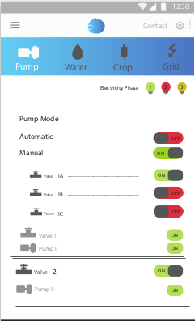
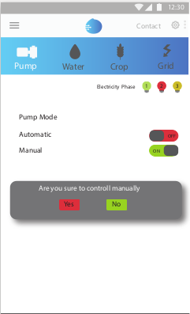
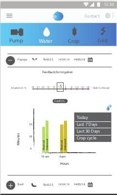
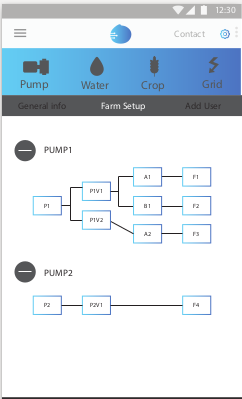

# Farm Hand

The FarmHand system (FH) is a smart irrigation system to provide commercially robust
and viable product that can be deployed across and configured for multiple farms. The
system analyses its performance taking the farmer’s irrigation feedback into account. The
future irrigation schedules and the quantity of water that needs to be supplied are
determined with the help of a machine learning based model which is trained using the
general crop data and farmer’s feedback. The model predicts an irrigation schedule for the
next 5 days which leads to water conservation and increase in yield.

A progressive web application (PWA) for farmers that allows them to turn on/off 
the pumps and valves directly from the mobile app and monitor their irrigation schedules
remotely. Farmers provide irrigation feedback to the FarmHand system, based on which
the model achieves precision over time. The app also has provision for the farmers to add
family members to the system who can control the irrigation schedules on their behalf.

## 3-Phase & Automatic Pump/Valve control

## Automatic/Manual Control

## Feedback & Irrigation History

## Farm Setup

