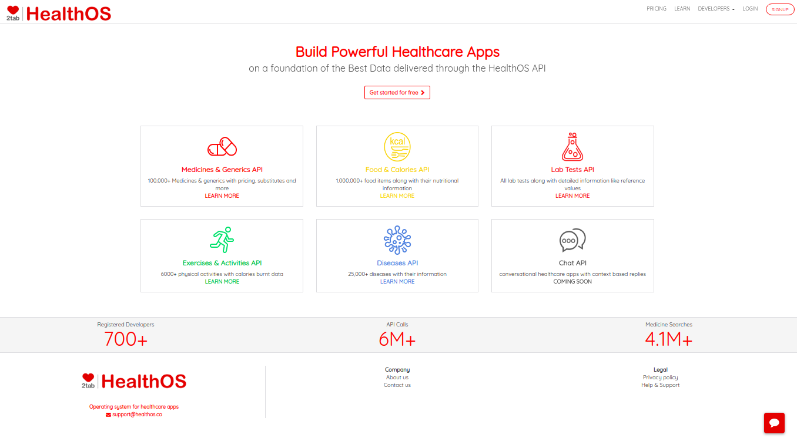
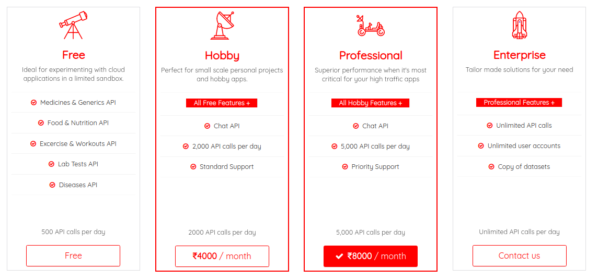

# The HealthOS Project

HealthOS is an open platform that allows creators & innovators to build healthcare applications.
The platform provides developers to an unprecedented access t0 6 different datasets that can be used to create apps ranging from EHR, e- Prescription, medicine reminders to wellness apps like fitness tracker or food-calories tracker.

HealthOS provides API access to the following datasets: 
1. Medicines & Generics API
2. Food & Calories API
3. Exercises & Activities API
4. Lab Tests API
5. Diseases API
6. Chat API

## Pricing



