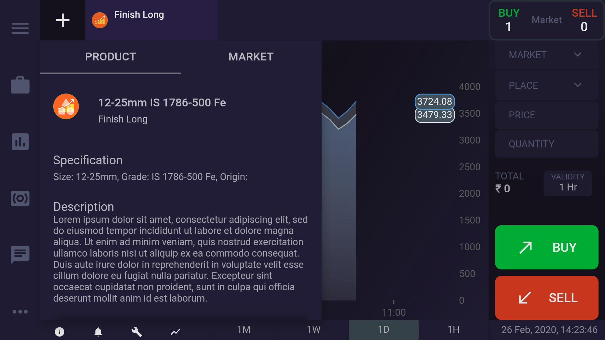
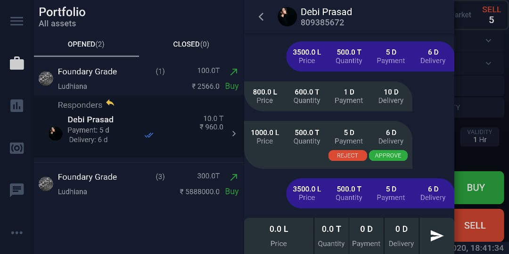

# The Steelmandi Project

Steelmandi-app is a mobile only solution for steel traders that enables to realtime trading, 
negotiation, news, tenders, analytics and all other relevant information.
The aim is to make an informed data-driven trading decision over hunches & emotions.

## Product Details

## Portfolio Section

